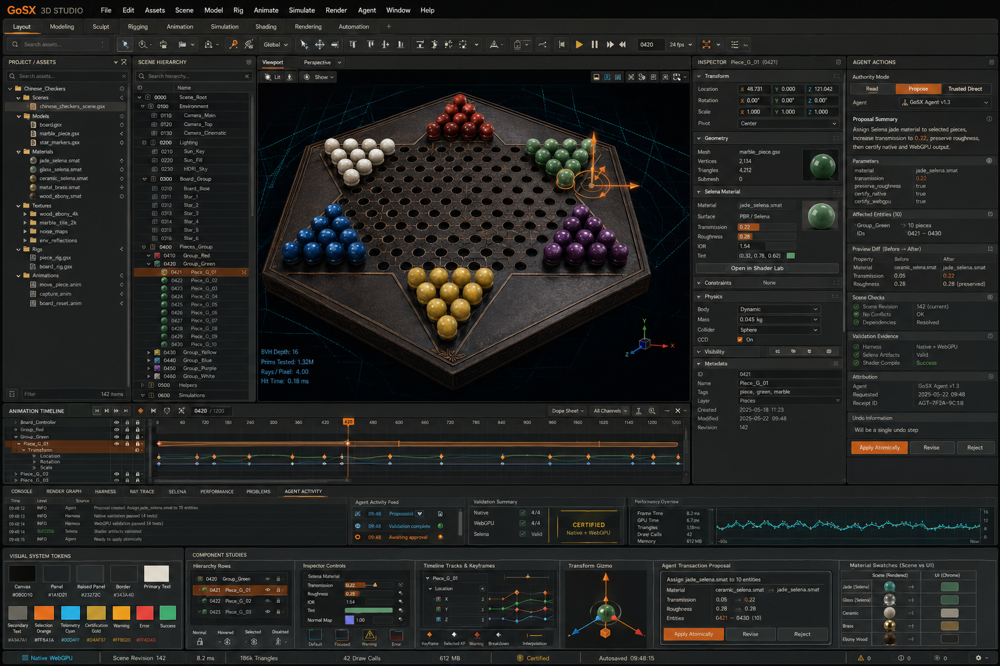
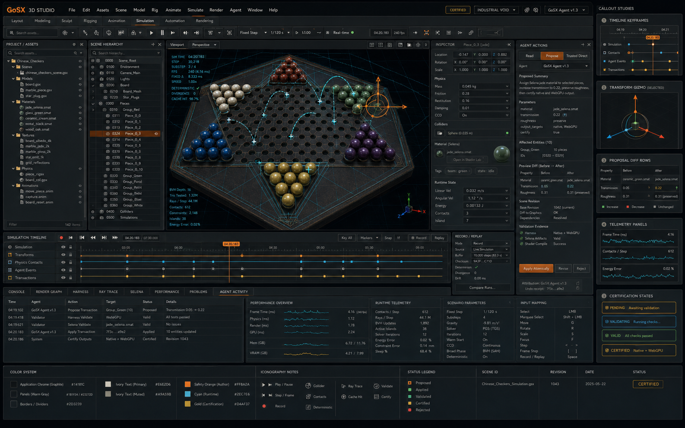

# GoSX 3D Studio design references

This directory holds durable visual references for the standalone GoSX 3D
Studio application. These are product-direction artifacts, not runtime assets.

## Industrial Void master concept

- **Direction:** Industrial Void
- **Principle:** The interface feels physical; the scene feels infinite.
- **Purpose:** Initial editor-shell, viewport, Inspector, timeline, telemetry,
  certification, and agent-transaction reference for implementation handoff.
- **Scene:** Chinese Checkers asset bench.
- **Generated:** 2026-07-13 using ChatGPT image generation from the approved
  GoSX 3D Studio product-design prompt.
- **Original filename:** `ChatGPT Image Jul 13, 2026, 09_23_09 PM.png`
- **Source SHA-256:**
  `07767ad6374b13aeb2436dabb1db87268584b8005da99c87fb88ba9712e0a354`

The image is an aspirational design reference. Labels and displayed metrics do
not imply that the corresponding feature is implemented or certified.

## Simulation and agent workspace

This is the most informative of the first detailed-workspace studies. It is the
implementation reference for the product's differentiating surfaces:

- fixed-step simulation authoring and record/replay;
- structured agent proposals and atomic application;
- runtime telemetry and exact-query overlays;
- certification state transitions;
- timeline events, input mapping, and scenario parameters; and
- the Industrial Void color and icon semantics.

- **Generated:** 2026-07-13 using ChatGPT image generation.
- **Original filename:** `ChatGPT Image Jul 13, 2026, 09_30_45 PM (3).png`
- **Source SHA-256:**
  `7b5d01f025daa61a3137f3676ddd0998d6035b27945876dd954055dc7d11cba7`

The companion modeling and shading studies were reviewed but intentionally not
retained. They are narrower workflow explorations and should not override this
image or the master concept when making application-wide layout decisions.
